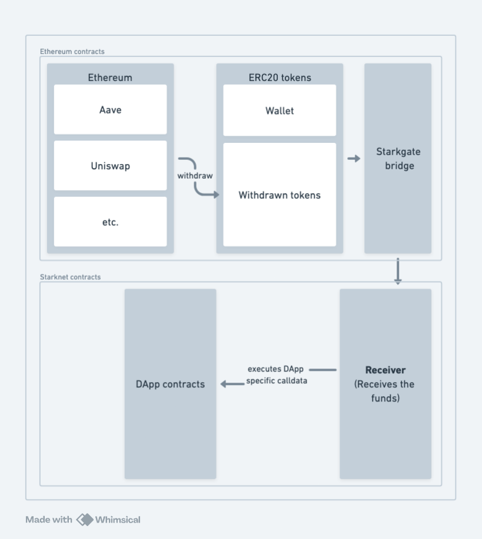

# Starkpull
Starkpull is a react/nestjs library that allows any starknet DApp to add a cross-chain 1-click asset bridge and deposit feature. This allows users to deposit assets from other chains to the starknet DApp with simple UX.

## Features
1. 1-click asset bridge and deposit feature
2. Asset migration from cross-chain DApps

## Scope and support
Below table lists the supported chains, DApps and assets for the asset bridge and deposit feature.  
| Chain | Source | Asset | Status |
| --- | --- | --- | --- |
| Ethereum | Wallet | ETH/STRK/wBTC/DAI/USDC/USDT | TODO |
| Ethereum | Aave | ETH/STRK/wBTC/DAI/USDC/USDT | TODO |
| Ethereum | Uniswap | ETH/STRK/wBTC/DAI/USDC/USDT | TODO |
| Ethereum | Compound | ETH/STRK/wBTC/DAI/USDC/USDT | TODO |
| Solana | Wallet | USDC/USDT | TODO |

## Technical details
This project involves 2 components:  
1. Contracts
2. React/NextJS frontend which is the library that can be integrated into any starknet DApp

### Starkpull contracts
Below is the flow of funds assuming ETH is the target chain. The target chain contracts will have functions that can withdraw funds of users, send them to starkgate with a pre-configured receiver address that shall receive funds and deposit those funds to target DApp. The DApp can pass custom call data to handle this deposit.  

### Starkpull frontend
Will be added soon

## Contributors
Will be added soon